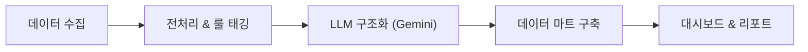

# 🧴 올리브영 썬크림 리뷰로 “미충족 니즈” 발굴하기

  

> **"썬크림, 다 거기서 거기 아닌가요?"**  
> 아닙니다. 이 프로젝트는 수만 건의 리뷰 속에 숨겨진 **"소비자가 원했지만 충족되지 않은(Unmet Needs)"** 패턴을 찾아내는 데이터 분석 프로젝트입니다.

---

## 📖 0. 프로젝트 배경 (Context)

### 상황 (Scenario)
화장품 시장, 특히 썬크림 카테고리는 이미 '레드오션'입니다. 자외선 차단력은 기본이고, 발림성, 톤업, 성분 등 수많은 제품이 상향 평준화되어 있습니다. 이런 상황에서 신상품 기획자는 항상 고민합니다.

> *"도대체 뭘 더 개선해야 팔릴까? 사람들은 진짜 뭘 원할까?"*

### 문제 (Problem)
기존의 시장 조사는 "잘 팔리는 제품"을 벤치마킹하는 데 그치거나, "좋아요" 감정에만 집중합니다. 하지만 진짜 기회는 **"기대하고 샀는데 실망한 지점"** 즉, **Expectation-Experience Gap**에 있습니다.

### 해결 (Solution)
이 프로젝트는 **11,000건의 올리브영 리뷰**를 분석하여, 단순히 "별점이 낮은 이유"가 아니라 **"구조적으로 해결되지 않고 있는 미충족 니즈" 5가지**를 발굴했습니다. 이를 위해 최신 **LLM(Gemini 2.0)**을 활용하여 인간의 뉘앙스를 대량으로 패턴화했습니다.

---

## 📊 1. 핵심 결과 미리보기 (Key Findings)

분석 결과, 소비자들이 가장 크게 느끼는 **5대 미충족 니즈**는 다음과 같습니다.

| 순위 | 니즈 키워드 | 소비자의 목소리 (Voice of Customer) | 인사이트 |
|:---:|---|---|---|
| **1** | **자극/트러블** (Irritation) | "순하다고 광고해서 샀는데, 바르자마자 따가워요." | 저자극 마케팅이 오히려 더 높은 기대치를 형성하여 실망감 유발 |
| **2** | **유분/번들거림** (Oiliness) | "처음엔 촉촉한 줄 알았는데 오후엔 개기름이..." | '촉촉함'과 '번들거림' 사이의 간극 존재 |
| **3** | **밀림/뭉침** (Makeup) | "화장 안 할 땐 좋은데, 파데만 올리면 때처럼 밀려요." | 메이크업과의 궁합(Interoperability) 문제 대두 |
| **4** | **건조/속건조** (Dryness) | "겉은 번들거리는데 속은 당겨요." | 복합성 피부를 위한 유수분 밸런스 니즈 |
| **5** | **톤업** (Tone-up) | "가부키 화장처럼 허옇게 뜨거나, 톤 보정이 1도 안 돼요." | '자연스러운' 톤업에 대한 기준이 매우 구체적임 |

> 👉 **자세한 분석 결과는 [최종 PDF 리포트](report/final/suncream_unmet_needs_report_v2.pdf)와 [웹 대시보드](report/site/index.html)에서 확인할 수 있습니다.**

---

## 🛠️ 2. 분석 파이프라인 (Methodology)

이 프로젝트는 **데이터 수집 → 전처리/태깅 → LLM 심층 분석 → 시각화**의 4단계로 구성됩니다.



### Step 1. 데이터 수집 (Data Collection)
*   **Source**: 올리브영 온라인몰 썬크림 카테고리
*   **Volume**: 543개 제품 중 주요 148개 제품, **총 11,528건 리뷰**
*   **Strategy**: 편향을 방지하기 위해 4가지 기준으로 샘플링
    *   `Helpful`: 도움이 돼요 많은 순 (정보량 풍부)
    *   `Newest`: 최신순 (최신 트렌드 반영)
    *   `Low Rating`: 평점 낮은 순 (불만 사항 분석)
    *   `High Rating`: 평점 높은 순 (조건부 만족 분석)

### Step 2. 전처리 & 룰 베이스 태깅 (Preprocessing)
*   **Noise Filtering**: 체험단 리뷰(약 7%), 무의미한 단답형 리뷰 제거
*   **Tagging**: `config/tag_lexicon_v2.yaml` 사전을 활용해 계절(여름, 겨울), 피부타입(지성, 건성), 상황(운동, 메이크업전) 태깅

### Step 3. LLM 기반 구조화 (Advanced Analysis with Gemini)
비정형 텍스트인 리뷰를 **Google Gemini 2.0 Flash** 모델에게 입력하여 구조화된 JSON 데이터로 변환했습니다.

*   **ABSA (Aspect-Based Sentiment Analysis)**: 리뷰 문장 내에서 속성(Aspect)과 감성(Polarity) 쌍을 추출
*   **Expectation-Experience Mapping**:
    *   *"순할 줄 알았는데(기대) 따가웠다(경험/불만)"*
    *   *"백탁은 있지만(단점) 톤업은 확실하다(장점)"*
    *   위와 같은 복합적인 맥락을 놓치지 않고 **조건부 만족**까지 포착

### Step 4. 시각화 및 리포팅 (Discovery)
*   **Opportunity Map**: 세로축(구조적 불만 강도) x 가로축(언급 빈도) 매트릭스로 니즈를 시각화하여 '기회 영역' 포착
*   **Polarity Stack**: 각 속성별 만족/불만/조건부만족 비율 시각화

---

## 📂 3. 프로젝트 구조 (Refactoring)

```
sunblock-review-analysis/
├── config/                 # 설정 파일 (tag_lexicon 등)
├── data/                   # 데이터 디렉토리
│   ├── raw/                # 수집된 원본 데이터
│   ├── processed/          # 전처리된 데이터
│   ├── llm/                # LLM 추출/분석 데이터
│   └── analysis/           # 최종 분석용 통계 테이블
├── notebooks/              # 분석용 Jupyter Notebook
├── report/                 # 생성된 리포트 및 대시보드
│   ├── site/               # 인터랙티브 웹 보고서 (index.html)
│   └── final/              # 경영진 보고용 PDF
├── src/                    # 소스 코드
│   ├── processing/         # 데이터 전처리 모듈 (Step 3)
│   ├── analysis/           # 데이터 분석 모듈 (Step 4)
│   ├── dashboard/          # 대시보드/PDF 생성 모듈 (Step 5)
│   └── ...                 # 크롤링/공통 모듈
├── config.yaml             # 크롤링 설정
├── run_pipeline.sh         # 통합 실행 스크립트
└── requirements.txt        # 의존성 패키지 목록
```

---

## 🚀 4. 실행 방법 (Detailed Execution Guide)

### 0. 원클릭 파이프라인 실행
전체 분석 과정을 (수집 제외) 한 번에 실행합니다.

```bash
chmod +x run_pipeline.sh
./run_pipeline.sh
```

### 1-2. 데이터 수집 (Crawling)
올리브영 사이트에서 상품 및 리뷰 데이터를 수집합니다.

```bash
# 전체 수집 (카탈로그 -> 리뷰 -> 태깅)
python -m src.pipeline crawl_all
```

### 3. 데이터 전처리 (Processing)
수집된 리뷰를 정제하고 분석 가능한 형태로 가공합니다.

**Step 3-0: Baseline 전처리**
```bash
python -m src.processing.baseline
```

**Step 3-0.5: 중복 제거**
```bash
python -m src.processing.deduplication
```

**Step 3-1: 태깅 (Attribute/Context/Skin)**
```bash
python -m src.processing.tagging
```

**Step 3-2: LLM 분석 큐 생성**
```bash
python -m src.processing.llm_queue
```

### 4. 탐색적 데이터 분석 (EDA) & 고급 분석 (Analysis)
데이터의 기초 통계 확인 및 다각도 분석을 수행합니다.

**탐색적 데이터 분석 (EDA)**
`notebooks/eda_exploration.ipynb` 노트북을 통해 데이터를 직접 탐색해볼 수 있습니다.
- **주요 내용**: Bucket/Context/Season/Aspect 별 Unmet Rate 시각화 및 샘플 리뷰 확인

**Step 4-0: Join & Pivot 테이블 생성**
```bash
python -m src.analysis.join_pivot
```

**Step 4-1: 인사이트 리포트 생성**
```bash
python -m src.analysis.insight_report
```

### 5. 대시보드 및 리포트 (Dashboard)
최종 결과물을 시각화하고 PDF로 변환합니다.

**Step 5: 대시보드 데이터 빌드**
```bash
python -m src.dashboard.build_dashboard
```

**Step 5-1: PDF 발행** (Playwright 필요)
```bash
python -m src.dashboard.export_pdf
```

---

## ⚠️ 한계점 (Limitations)
*   **샘플링 편향**: 전체 리뷰가 아닌 일부 샘플링 데이터이므로, 실제 시장 점유율과는 다를 수 있습니다.
*   **모델 환각(Hallucination)**: LLM이 맥락을 잘못 해석할 가능성이 미세하게 존재합니다(검증 결과 파싱 성공률 94%).
*   **비상업적 용도**: 본 프로젝트는 포트폴리오 및 연구 목적으로 진행되었습니다.
